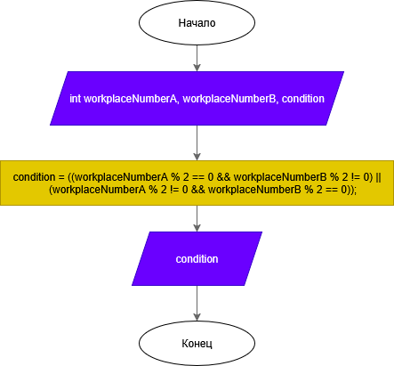
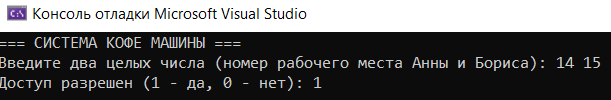

# Домашнее задание к работе 4

## Условие задачи
Два программиста, Анна (A) и Борис (B), дежурят ночью. Чтобы было не так скучно, они решили, что будут пить кофе только если кто-то один из них четный (по номеру своего рабочего места). Запишите условие для кофе-машины.

## 1. Алгоритм и блок-схема

### Алгоритм
1. **Начало**
2. Ввести два целых числа: `workplaceNumberA` и `workplaceNumberB` — номера рабочих мест Анны и Бориса.
3. Проверить чётность каждого числа:
   - `workplaceNumberA % 2 == 0` — место Анны чётное.
   - `workplaceNumberB % 2 == 0` — место Бориса чётное.
4. Составить условие для включения кофе-машины:
   - `(workplaceNumberA % 2 == 0 && workplaceNumberB % 2 != 0) || (workplaceNumberA % 2 != 0 && workplaceNumberB % 2 == 0)`
5. Если условие выполняется, вывести `1` (да), иначе `0` (нет).
6. **Конец**

### Блок-схема


https://github.com/DragonSov/lab4_homework/blob/master/schema.png

## 2. Реализация программы

```c
#include <stdio.h>
#include <locale.h>

int main()
{
    int workplaceNumberA, workplaceNumberB;

    int condition;

    setlocale(LC_CTYPE, "RUS");

    // Сообщаем пользователю, что делает программа

    printf("=== СИСТЕМА КОФЕ МАШИНЫ ===\n");

    printf("Введите два целых числа (номер рабочего места Анны и Бориса): ");

    // Считываем два кода, введенные пользователем

    scanf("%d %d", &workplaceNumberA, &workplaceNumberB);


    // Вычисляем сложное логическое условие
    // 1. Проверяем, что только один код чётный: 
    //    (workplaceNumberA четный И workplaceNumberB нечетный) ИЛИ (workplaceNumberA нечетный И workplaceNumberB четный)
    // 2. Объединяем два условия с помощью логического ИЛИ

    condition = ((workplaceNumberA % 2 == 0 && workplaceNumberB % 2 != 0) ||
        (workplaceNumberA % 2 != 0 && workplaceNumberB % 2 == 0));

    // Выводим результат

    printf("Доступ разрешен (1 - да, 0 - нет): %d\n", condition);

    return 0;
}
```

## 3. Результаты работы программы


## 4. Информация о разработчике
Попов Станислав, бИПТ-252
